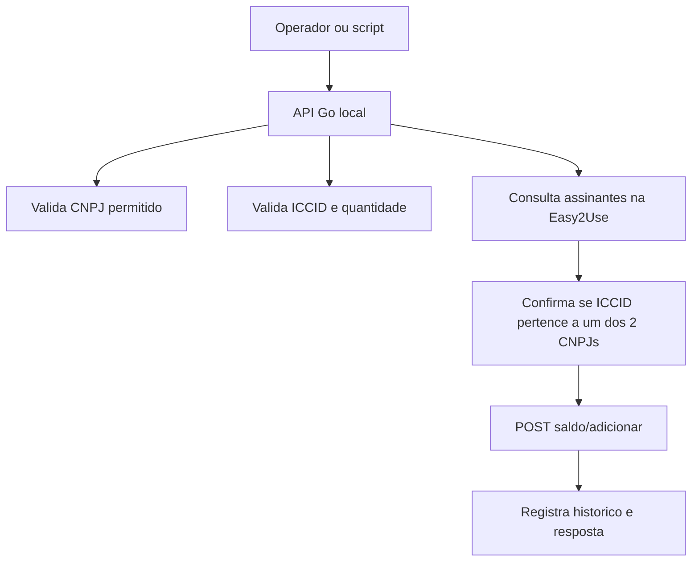
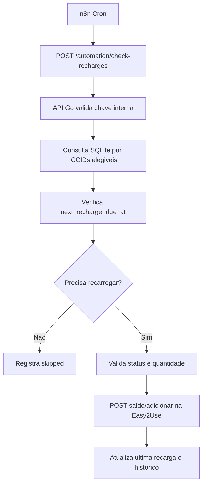

# Arquitetura

## Objetivo

Automatizar a adicao preventiva de saldo de GB em ICCIDs/SIM Cards vinculados a 2 CNPJs autorizados.

O sistema consulta os assinantes na plataforma Easy2Use/Tip Brasil, identifica os contratos/chips vinculados aos CNPJs permitidos, verifica a data da ultima recarga registrada e adiciona saldo quando o ICCID estiver dentro da janela configurada para recarga preventiva.

Regra operacional validada:

```text
Prazo maximo sem recarga: 11 meses
Janela preventiva: 10 dias antes
Quantidade padrao: 1 GB
```

## API externa usada

Base informada:

```text
https://easy2use.com.br/mvno/api/public
```

Endpoint de ultima recarga informado com base Tip Brasil:

```text
https://mvno.tipbrasil.com.br/api/public
```

No `.env`, a base deve ser configuravel para aceitar o host correto usado em producao.

Listar assinantes:

```text
GET /assinantes/listar?user_token={token}
```

Adicionar saldo:

```text
POST /simcard/{numero_simcard}/saldo/adicionar?user_token={token}
```

Consultar data da ultima recarga:

```text
GET /simcard/{numero_simcard}/ultima-recarga?user_token={token}
```

Resposta:

```json
{
  "ultima_recarga": "2025-09-01",
  "codigo_status_tip": "0"
}
```

Tambem e permitido usar telefone com DDD no lugar do SIM Card:

```text
POST /simcard/{telefone_com_ddd}/saldo/adicionar?user_token={token}
```

Body:

```json
{
  "quantity": 5
}
```

## Regras de saldo

Quantidade:

- Inteiro em GB
- Minimo: 1 GB
- Nao permite numero quebrado, como 1.5 GB

Limites por operadora:

```text
AmericaNet: sem limite informado
Surf Consumo: maximo 5 GB
Surf Markup: maximo 2 GB
Telecall Consumo: maximo 5 GB
Telecall Markup: maximo 2 GB
```

## Fluxo simples sob demanda



## Fluxo de rotina preventiva com n8n



## Componentes do MVP

### API Go

Endpoints internos:

```text
GET  /health
POST /sync/assinantes
POST /sync/ultima-recarga
GET  /iccids
POST /iccids/{iccid}/saldo
POST /automation/check-recharges
GET  /automation/next-run
GET  /operacoes
GET  /operacoes/{id}
```

### Cliente Easy2Use

Responsavel por:

- Montar URLs
- Enviar token
- Listar assinantes
- Consultar data da ultima recarga por ICCID
- Adicionar saldo ao ICCID
- Ler resposta e erros
- Mascarar token nos logs

### Banco local

Responsavel por:

- Guardar ICCIDs encontrados
- Guardar os 2 CNPJs permitidos
- Registrar cada tentativa de adicionar GB
- Registrar data da ultima recarga por ICCID
- Registrar execucoes da rotina automatica
- Guardar resposta da Easy2Use para auditoria

## Estrategia para gastar menos recursos

O backend deve mapear as datas de recarga de cada ICCID e salvar `next_recharge_due_at`.

Com isso, a rotina diaria do n8n fica barata:

```text
1. n8n chama POST /automation/check-recharges.
2. Backend consulta SQLite por ICCIDs com next_recharge_due_at <= hoje.
3. Se nao houver nenhum, retorna sem chamar a Easy2Use.
4. Se houver, adiciona 1 GB apenas nesses ICCIDs.
```

Isso evita listar assinantes e consultar historico na Easy2Use todos os dias.

Rotinas sugeridas:

```text
Diaria: POST /automation/check-recharges
Semanal: POST /sync/assinantes
Semanal ou mensal: POST /sync/ultima-recarga
```

Se quiser reduzir ainda mais chamadas do n8n, criar:

```text
GET /automation/next-run
```

Esse endpoint retorna a proxima data em que algum ICCID deve ser recarregado.

## Organizacao sugerida

```text
cmd/
  api/
    main.go

internal/
  config/
  http/
    handlers/
    middleware/
  easy2use/
    client.go
    types.go
  domain/
    iccid.go
    operation.go
  storage/
    sqlite/
  security/

migrations/
docs/
```

## Decisao importante

No MVP, a operacao deve ser sincrona:

1. Recebe pedido.
2. Valida se o ICCID pertence a um dos CNPJs permitidos.
3. Chama a Easy2Use.
4. Salva o resultado.
5. Retorna sucesso ou erro.

Fila e worker ficam para uma fase futura, caso haja volume alto ou necessidade de lote/retry.

## Regra de decisao da rotina

A rotina deve avaliar cada ICCID ativo dos CNPJs permitidos.

Campos importantes:

```text
last_recharge_at
recharge_interval_months
safety_window_days
default_quantity
next_recharge_due_at
```

Exemplo de regra:

```text
next_recharge_due_at = last_recharge_at + 11 meses - 10 dias

se hoje >= next_recharge_due_at
entao adicionar 1 GB
```

Exemplo:

```text
Intervalo necessario: 11 meses
Janela de seguranca: 10 dias
Ultima recarga: 2026-01-01
Data limite: 2026-12-01
Sistema recarrega a partir de: 2026-11-21
```

Esses numeros devem ficar configuraveis, mas o padrao inicial sera 11 meses, 10 dias de seguranca e 1 GB.
